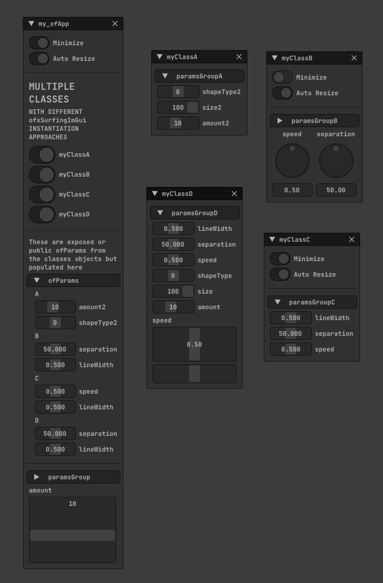

	This is a WIP example to explore the workflow and debug how to combine multiple instances of ofxImGui  
	inside an ofxSurfingImGui class who acts as a kind of manager.  
	
	Many classes (myClassA-B-C-D) with some instantiated objects (A, B, C, D)  
	will populate widgets for ofParams but using different approaches.  
	
	--  
	
	ofxSurfingImGui is a kind of a ( WIP ) higher level class,  
	with more OF ofParameters helpers and a Toolkit with more features:  
	Styled widgets, layout helpers, windows management, window aligners,  
	layout presets, log and floating notifications engine,  
	docking helpers, profile and plotting tools, and much more.  
	
	Important: ui acts as a manager, registering the populated windows and ofParams widgets  
	handling internal unique IDs (to avoid params collide) and each widgets styling and layout.  
	
	Uses the ofxImGui fork from @Daandelange: https://github.com/Daandelange/ofxImGui.  
	The original repo from @jvcleave https://github.com/jvcleave/ofxImGui  
	has many limitations like being limited to use only one ImGui context instance.  
