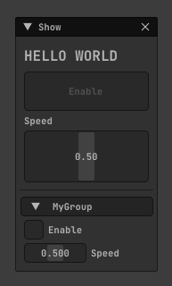
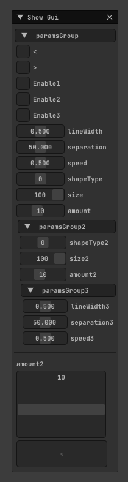
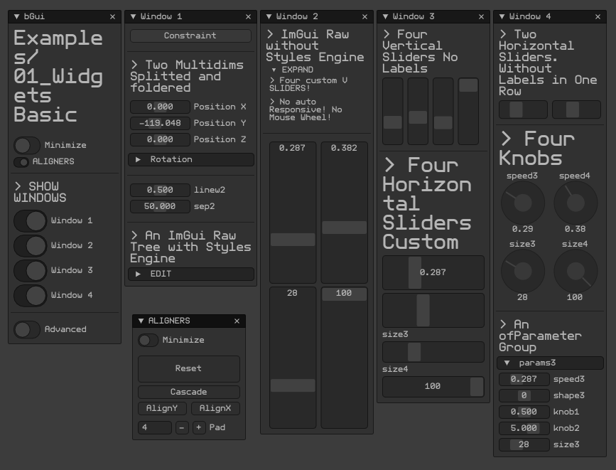
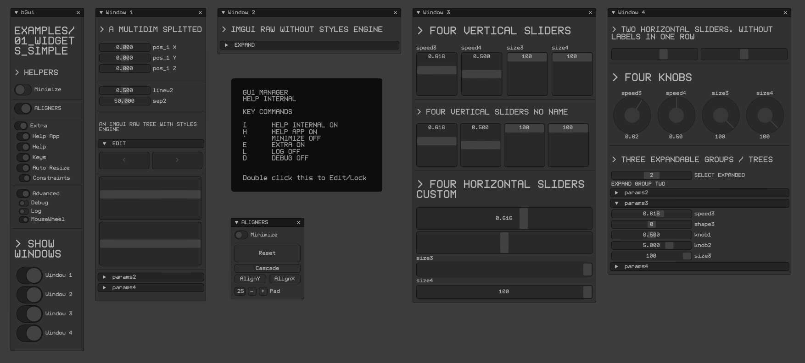
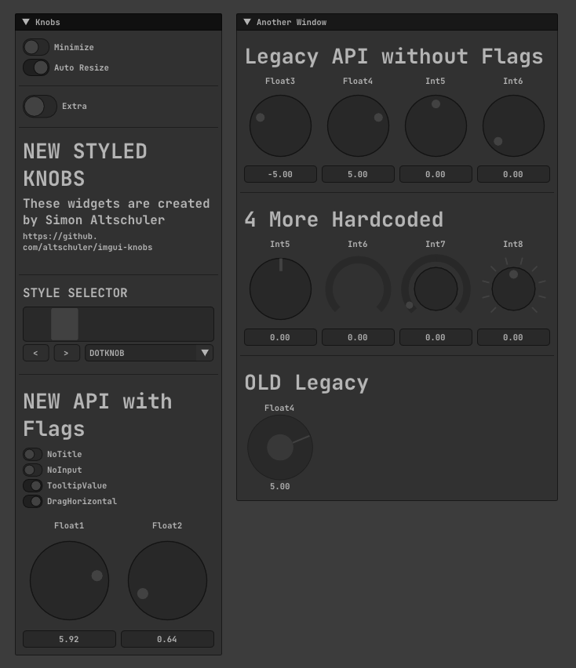
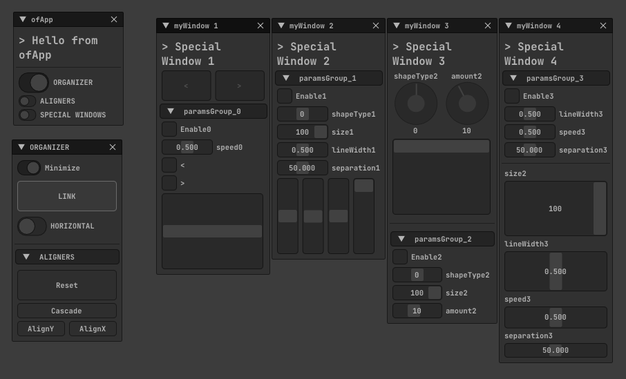
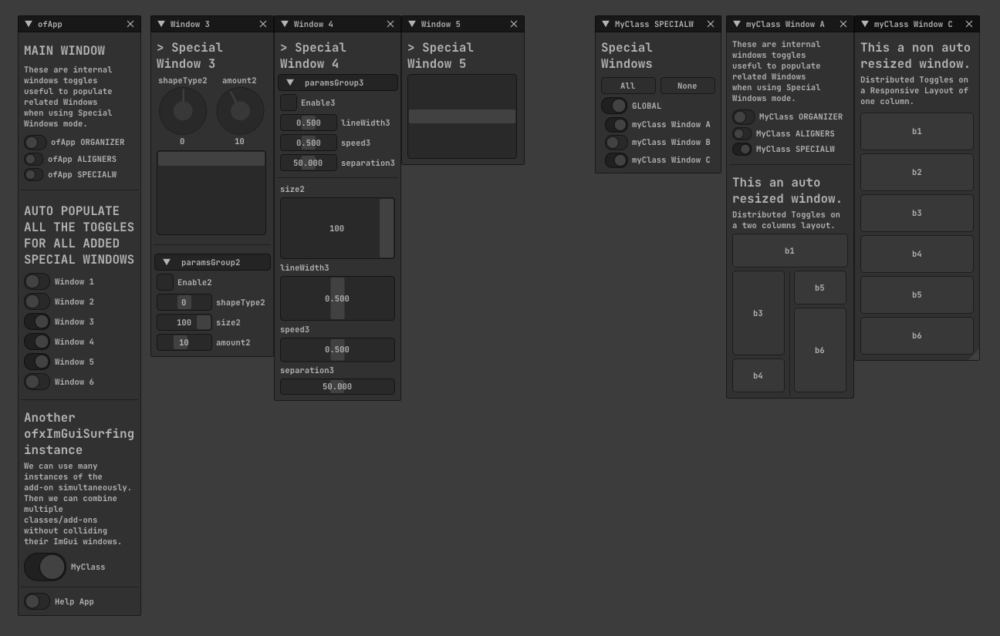
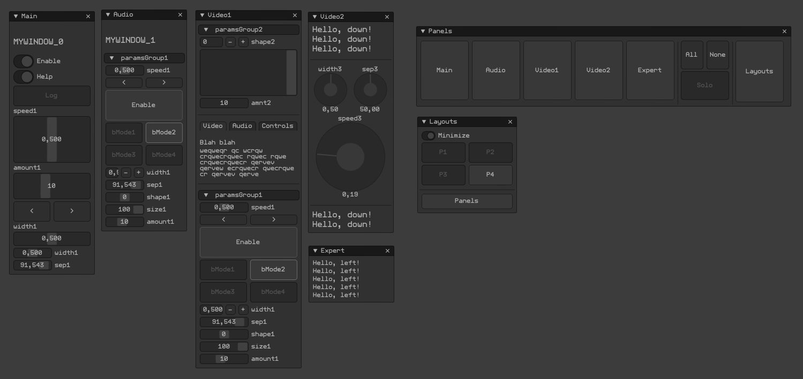
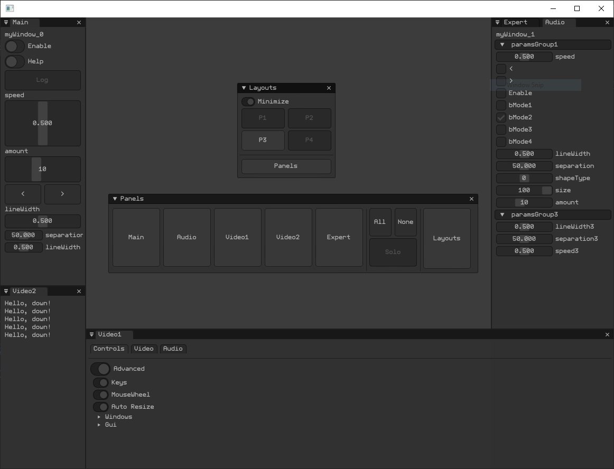

## 00_HelloWorld
  

## 00_Simple
  

## 01_WidgetsBasic
  

## 02_Widgets
  

## 03_WidgetsKnobs
  

## 04_Log
  

## 10_SpecialWindows
  

## 11_SpecialWindowsAdvanced
  

## 20_LayoutsEngine
  

## 30_LayoutsEngineDocking
  

 

# VIDEOS

<h2>LOG SYSTEM</h2>

<h2>LAYOUT PRESETS ENGINE & DOCKING</h2>

  