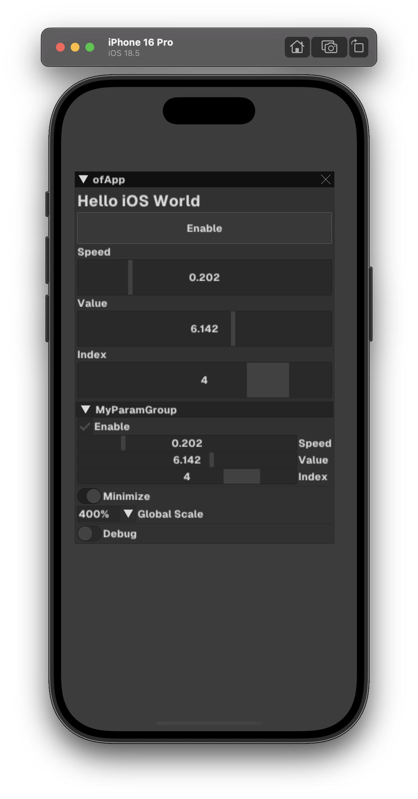
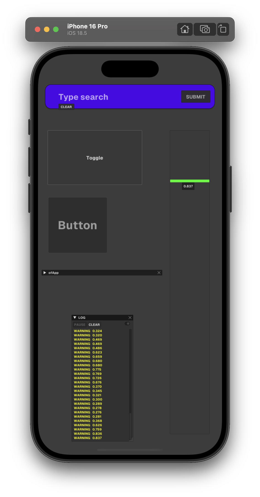

# WIP - IN DEVOLOPMENT

Using a pending [PR / fork](https://github.com/Daandelange/ofxImGui/pull/24) for *ofxImGui*!  
https://github.com/jvcleave/ofxImGui/tree/develop  
(Mirrored to https://github.com/Daandelange/ofxImGui)  

### TESTED USING
https://github.com/openframeworks/openFrameworks/releases/download/0.12.1/of_v0.12.1_ios_release.tar.gz  

**Xcode 16.4**, **macOS Tahoe beta** 16.0. Silicon Apple. M1.  
iOS simulators and device running **iOS 18.5**  
Working in the simulator _iPad(A16)_ and in my _iPad (10th / iOS 18.6)_ device too.  

# EXAMPLES

## 61_iOS_Simple
  

## 62_iOS_BigWidgets
  
