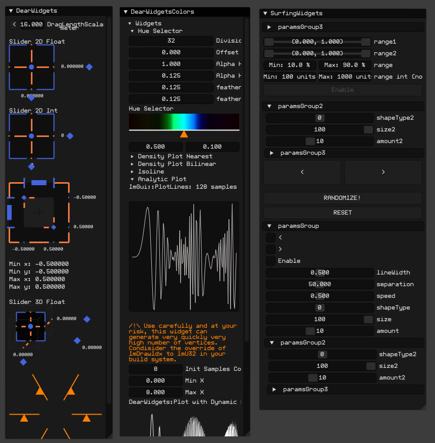

ofxSurfingImGui
=============================

#### WORK IN PROGRESS
### **BUG 1**:  
    * When adding many times a parameter or others with a not unique name.  
    * Widgets collide between them. Only some instances work well. (Sometimes)  
### **BUG 2**:  
    * Layout engine fails a bit on nesting indented groups.  
    * Broken width recalculation and "unlimited" growing when auto-size.  
    * Workaround fix using CollapsingHeader instead of TreeNodeEx  
	but I would prefer the indented nested groups.

---------------------------------------------------------

## Overview
**ofxSurfingImGui** is a helper add-on with _Snippets / Helpers / LayoutManagement / Widgets_ to easy integrate **ImGui** into **openFrameworks**.

## Features 
* Requires the _awesome_ @**Daandelange**'s fork: 
    - Why? Easy to update to future **new ImGui** versions and multi context/instances.
* **ImGui Widgets**: big toggles and buttons, range sliders, DearWidgets...etc.
* **Layout Manager** to speed up **windows creation** and fit-widgets-width-to-window sizes.
* Included my **Dark Theme**.

### IMPORTANT CHANGES (vs ofxImGui helpers)  
- Simplified **OF Helpers** to use **ofParameters** easy and better. 
    * _ImHelpers.h_ has been rewritten to _ofxSurfing_ImGui_Helpers.h_.
    * Widgets, windows/trees now are more customizable. 
    * Removed old windows/tree methods. Now must use **RAW ImGui** code.
    * Removed all the WindowOpen/Settings stuff.
    * Removed all the old _GetUniqueName_ engine from **ofxImGui**. 
    * Now using PushId(1)/PopID() on each widget.

## Examples Screenshots

### 1_Widgets
* Shows **ofParameter** helpers with full/half/third/quarter width buttons, toggles, DearWidgets, range sliders and ofxImGui standard params.  

  
<!--  -->

---------------------------------------------------------

### 2_Layout_Basic
* Uses **ofxSurfing_ImGui_LayoutManager.h**  
* Speed up ofxImGui instantiation, windows and layouts. 
* Includes **ofParameter** helpers and extra widgets.  

  
<!--  -->
```.cpp
//ofApp.h
#include "ofxSurfingImGui.h"
ofxSurfing_ImGui_Manager guiManager;

//ofApp.cpp
void ofApp::setup() { 
    guiManager.setup(); // instantiates and configures ofxImGui inside.
    // font, theme and other customizations.
}
void ofApp::draw() { 
    guiManager.begin();
    {
        guiManager.beginWindow("Window1", &bOpen1, window_flags1);
        {
            // precalculate widgets sizes to fit window "responsive"
            float _w100 = getImGui_WidgetWidth(1); // 1 widget full width
            float _w50 = getImGui_WidgetWidth(2);  // 2 widgets half width
            float _w33 = getImGui_WidgetWidth(3);  // 3 widgets third width
            float _h = WIDGETS_HEIGHT;

            /* Draw ImGui widgets */

            // One widget full with and half height
            if (AddBigToggle(b1, _w100, _h / 2)) {} 

            // Two widgets same line/row with the 50% of window panel width 
            if (AddBigButton(b3, _w50, _h)) {}
            ImGui::SameLine();
            if (AddBigButton(b4, _w50, _h)) {}

            // An extra panel for useful config: auto resize window, mouseOverGui..
            guiManager.drawAdvancedSubPanel();
        }
        guiManager.endWindow();
    guiManager.end();
}
```
---------------------------------------------------------

### 3_Layout_TypesEngine
* Uses **ofxSurfing_ImGui_WidgetsTypes.h** and **ofxSurfing_ImGui_Helpers.h**
* A more powerfull **Layout Engine** to improve "responsive" layouts.
* Draw each **ofParameter** types with different appearance.
    * EXAMPLE 1: _Draw a **float parameter** as slider (default), drag nuber or/and +/- stepper box._
    * EXAMPLE 2: _Draw a **bool parameter** as a check box (default), or as a big toggle button with custom dimensions._
* Especially useful when params are into an **ofParameterGroup**.
* Queue settings for a parameter to define configurations to be applied when the widget is drawn. 

#### Available customization options:
    - Hide the parameter.  
    - Set an **ImGui::SameLine** after the widget.  
    - Add a final vertical spacing after the widget.  
    - Set the widget width to divide the panel width and fit a defined amount of widgets per row/line.  

  
<!--  -->

#### Code
```.cpp
void ofApp::setup() 
{
    // feed bool, float and int parameters into an ofParameterGroup
    params.add(b1, b2, b3, f1, f2, i1, i2);

    // queue style for each parameter
    // format: 
    // void AddWidgetConf(ofAbstractParameter& aparam, 
    //                    ImWidgetSurfingTYPE type = IM_DEFAULT, 
    //                    bool bSameLine = false, 
    //                    int amtPerRow = 1, 
    //                    int spacing = -1)
    widgetsManager.AddWidgetConf(b1, SurfingWidgetTypes::IM_TOGGLE_BIG, false, 1, 20);
    widgetsManager.AddWidgetConf(b2, SurfingWidgetTypes::IM_BUTTON_SMALL, true, 2);
    widgetsManager.AddWidgetConf(b3, SurfingWidgetTypes::IM_BUTTON_SMALL, false, 2, 10);
    widgetsManager.AddWidgetConf(f1, SurfingWidgetTypes::IM_STEPPER);
    widgetsManager.AddWidgetConf(f2, SurfingWidgetTypes::IM_DRAG, false, 1, 10);
    widgetsManager.AddWidgetConf(i1, SurfingWidgetTypes::IM_SLIDER);
    widgetsManager.AddWidgetConf(i2, SurfingWidgetTypes::IM_STEPPER);
}
void ofApp::drawWidgets() 
{
    // format:
    // bool Add(ofAbstractParameter& aparam, 
    //          ImWidgetSurfingTYPE type = IM_DEFAULT, 
    //          bool bSameLine = false, 
    //          int amtPerRow = 1, 
    //          int spacing = -1)
    
    // instant draw each parameter
    widgetsManager.Add(b1, SurfingWidgetTypes::IM_TOGGLE_SMALL, false, 2);
    widgetsManager.Add(b2, SurfingWidgetTypes::IM_TOGGLE_SMALL, true, 2);
    widgetsManager.Add(i1, SurfingWidgetTypes::IM_SLIDER);
    widgetsManager.Add(i1, SurfingWidgetTypes::IM_STEPPER, false, 2, 20);

    // draw a group of params with previously queued styles
    ofxSurfing::AddGroup(params, flags);
}
```

---------------------------------------------------------

## Usage
* Look at the examples.

## Dependencies
[ofxImGui](https://github.com/Daandelange/ofxImGui/tree/ofParameters-Helpers-Test) from @**Daandelange**  
[ofxWindowApp](https://github.com/moebiussurfing/ofxWindowApp) [Not required. For some examples only]  

## Useful Links
https://github.com/HankiDesign/awesome-dear-imgui  
https://github.com/soufianekhiat/DearWidgets  
https://github.com/yumataesu/ImGui_Widgets  
https://github.com/njazz/AutomationCurveEditor  
https://github.com/leiradel/ImGuiAl  
https://github.com/aiekick/ImTools/tree/main/LayoutManager  

## TODO
* Add more examples and ImGui RAW widgets.

## Tested Systems
- **Windows10** / **VS2017** / **OF ~0.11**

## Author
An addon by **@moebiusSurfing**  
*( ManuMolina ) 2021*  

## License
**MIT License**
