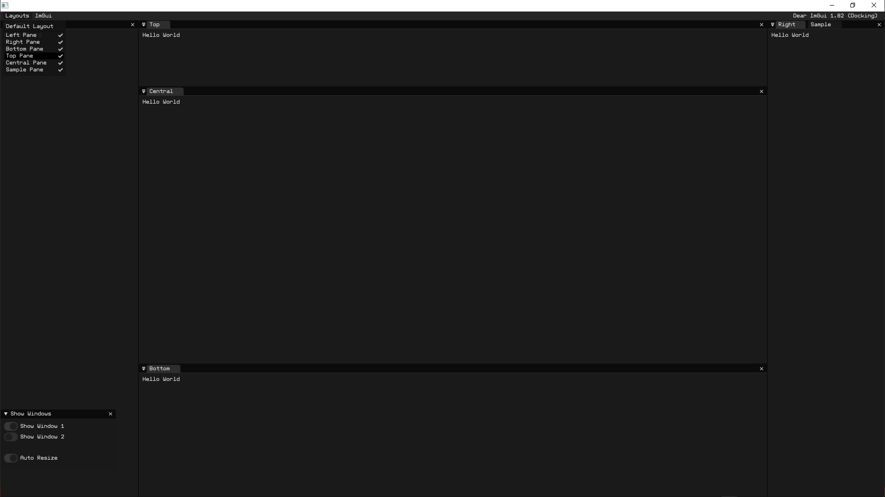

ofxSurfingImGui
=============================

## Overview
**ofxSurfingImGui** is a helper add-on with **ofParameter Helpers**, Setup and Layout Management, **RAW ImGui Widgets** ported to OF and useful Snippets to easy integrate **ImGui** into **openFrameworks** projects.  

## WORK IN PROGRESS!  
```
USABLE BUT NOT FINISHED.  
API WILL CHANGE AND I AM STILL HAVING SOME PROBLEMS YET.  
```

<details>
  <summary>BUGS</summary>
  <p>

### **BUG 1**: (ofxSurfing_ImGui_Helpers.h & ofxSurfing_ImGui_WidgetsButtons.h)  
    - When adding many times a parameter or others with a not unique name.  
    - Widgets collide between them. Only some instances work well.  
    - Usually, the first repeated widget in each panel works fine.  
    - SOLUTION: Restore old getUniqueName engine from ofxGui. Do not duplicate adding params or names.
### **BUG 2**: (ofxSurfing_ImGui_WidgetsTypes.h)  
    - Layout engine fails a bit on nesting indented groups.  
    - Broken width recalculation and "unlimited" growing when auto-size.  
    - Workaround fixed using CollapsingHeader instead of TreeNodeEx  
    but I would prefer the indented nested groups.
  </p>
</details>

## Features 
* Requires the _awesome_ @**Daandelange**'s [ofxImGui](https://github.com/Daandelange/ofxImGui/tree/ofParameters-Helpers-Test) fork: 
    - Why? Easy to update to future **new ImGui** versions and multi context/instances.
* **ImGui Widgets**: big toggles and buttons, range sliders, DearWidgets...etc.
* **Layout Manager** to speed up **windows creation** and fit-widgets-width-to-window sizes.
* Included my **Dark Theme**.

### IMPORTANT OF-RELATED CHANGES  
(vs ofxImGui helpers)  
- Simplified **OF Helpers** to use **ofParameters** easy and better. 
    * _ImHelpers.h_ has been rewritten to _ofxSurfing_ImGui_Helpers.h_.
    * Widgets, windows/trees now are more customizable. 
    * Removed old windows/tree methods. Now must use **RAW ImGui** code.
    * Removed all the WindowOpen/Settings stuff.
    * Removed all the old _GetUniqueName_ engine from **ofxImGui**. 
    * Now using PushId(1)/PopID() on each widget.


## A. WIDGETS
Shows **ofParameter** helpers with full/half/third/quarter width buttons, toggles, DearWidgets, range sliders, Bezier Curve, Spinner/Progress Indicators and ofxImGui standard params.  

### 1_1_Widgets_DearWidgets
Includes range sliders with ofParams, responsive button/toggles and the awesome [DearWidgets](https://github.com/soufianekhiat/DearWidgets) from **@soufianekhiat**.  

  

### 1_2_Widgets_Curve
Includes bezier curves and usable tween/easing functions.  

  

### 1_3_Widgets_Spinner
Includes wait and progression spinners.  

  

### 1_4_Widgets_Surfing
Includes a matrix button clicker selector linked to an int ofParam (aka preset index), small tooltips, spin clicker, and the awesome gradient engine from [@galloscript](https://twitter.com/galloscript) from his [Github Gist](https://gist.github.com/galloscript/8a5d179e432e062550972afcd1ecf112).  

  


## B. LAYOUT

### 2_1_Layout_Basic
* Uses **ofxSurfing_ImGui_LayoutManager.h**  
* Speed up ofxImGui instantiation, windows and layouts. 
* Includes **ofParameter** helpers and extra widgets.  

  

<details>
  <summary>Example Code</summary>
  <p>
  
    

ofApp.h
```.cpp
#include "ofxSurfingImGui.h"

ofxSurfing_ImGui_Manager guiManager;

bool bOpen3 = false;
ofParameter<bool> bEnable{ "Enable", true };
ofParameter<bool> b1{ "b1", false };
ofParameter<bool> b2{ "b2", false };
ofParameter<bool> b3{ "b3", false };
```
ofApp.cpp
```.c++
void ofApp::setup() { 
    guiManager.setup(); 
    // Instantiates and configures all the required ofxImGui stuff inside:
    // font, theme, autodraw, handle layout, and other customizations.
}
void ofApp::draw() { 
    guiManager.begin();
    {
        ImGuiWindowFlags window_flags = ImGuiWindowFlags_None;
        if (guiManager.bAutoResize) window_flags |= ImGuiWindowFlags_AlwaysAutoResize;

        guiManager.beginWindow("Window3", &bOpen3, window_flags);
        {
            ofxImGuiSurfing::AddToggleRoundedButton(bEnable);
            if (bEnable)
            {
                // Precalculate common widgets sizes to fit current window, "to be responsive".
                // Takes care of ImGui spacing between widgets.
                // Remeber to recall when panel is indented or inside an smaller tree!
                float _w100 = ofxImGuiSurfing::getWidgetsWidth(1); // 1 widget full width
                float _w50 = ofxImGuiSurfing::getWidgetsWidth(2);  // 2 widgets half width
                float _w33 = ofxImGuiSurfing::getWidgetsWidth(3);  // 3 widgets third width
                float _w25 = ofxImGuiSurfing::getWidgetsWidth(4);  // 4 widgets quarter width
                float _h = WIDGETS_HEIGHT;

                //-

                // Draw RAW ImGui or SurfingWidgets with ofParameters

                // One widget full with and half height
                if (AddBigToggle(b1, _w100, _h / 2)) {}

                // Two widgets same line/row with the 50% of window panel width 
                if (AddBigButton(b2, _w50, _h)) {}
                ImGui::SameLine();
                if (AddBigButton(b3, _w50, _h)) {}

                // Or using raw ImGui
                // Three widgets and fit width in one line
                if (ImGui::Button("START", ImVec2(_w33, _h))) {}
                ImGui::SameLine();
                if (ImGui::Button("STOP", ImVec2(_w33, _h))) {}
                ImGui::SameLine();
                if (ImGui::Button("REPLAY", ImVec2(_w33, _h))) {}
            }
        }
        guiManager.endWindow();
    }
    guiManager.end();
}
```
  </p>
</details>

### 2_2_Layout_TypesEngine
Fast ofParams widgets layout: width, height, items per row and differnt styles for same types or even repeated params.  

### 2_3_Layout_ImTools
Uses [ImTools](https://github.com/aiekick/ImTools) from **@aiekick**  
"Its a class for manage docking panes in a easy way, display (panes, menu, pane dialog), load/save, autolayout, etc..."  
**WIP** porting to use into my OF projects.  

  
<!--  -->
<!-- <br>  -->


## C. TYPES ENGINE

### 3_Layout_TypesEngine
* Uses **ofxSurfing_ImGui_WidgetsTypes.h** and **ofxSurfing_ImGui_Helpers.h**
* A more powerfull **Layout Engine** to improve "responsive" layouts.
* Draw each **ofParameter** types with different appearance.
    * EXAMPLE 1: _Draw a **float parameter** as slider (default), drag number or/and +/- stepper box._
    * EXAMPLE 2: _Draw a **bool parameter** as a check box (default), or as a big toggle button with custom dimensions._
* Especially useful when params are into an **ofParameterGroup**.
* Queue settings for a parameter to define configurations to be applied when the widget is drawn. 
<details>
  <summary>Code</summary>
  <p>

```.cpp
void ofApp::setup() 
{
    // Feed bool, float and int ofParameters into an ofParameterGroup
    params.add(b1, b2, b3, f1, f2, i1, i2);

    //-

    // Workflow A
    // Queue config style for each parameter

    // Format: 
    // void AddWidgetConf(ofAbstractParameter& aparam, 
    //                    ImWidgetSurfingTYPE type = IM_DEFAULT, 
    //                    bool bSameLine = false, 
    //                    int amtPerRow = 1, 
    //                    int spacing = -1)

    // One full width widget with 20px vertical spacing at end
    widgetsManager.AddWidgetConf(b1, SurfingWidgetTypes::IM_TOGGLE_BIG, false, 1, 20);
    // Two widgets in the same line with 10px of spacing at end
    widgetsManager.AddWidgetConf(b2, SurfingWidgetTypes::IM_BUTTON_SMALL, true, 2);
    widgetsManager.AddWidgetConf(b3, SurfingWidgetTypes::IM_BUTTON_SMALL, false, 2, 10);
    // A widget presented with number and +/- controls
    widgetsManager.AddWidgetConf(f1, SurfingWidgetTypes::IM_STEPPER);
    // The same parameter but as a slider and 10px spacing at the end
    widgetsManager.AddWidgetConf(f2, SurfingWidgetTypes::IM_DRAG, false, 1, 10);
    // A widget as slider with full width size
    widgetsManager.AddWidgetConf(i1, SurfingWidgetTypes::IM_SLIDER);
    // An widget as stepper with full width size
    widgetsManager.AddWidgetConf(i2, SurfingWidgetTypes::IM_STEPPER);
}

void ofApp::draw()
{
    guiManager.begin();
    {
        guiManager.beginWindow("Window", &bOpen, window_flags);
        {
            drawWidgets();
        }
        guiManager.endWindow();
    }
    guiManager.end();
}

void ofApp::drawWidgets() 
{
    // Workflow A
    // Draw a group of params with previously queued param styles on setup() 
    // Use flags to customize tree/folder
    ImGuiTreeNodeFlags flags = ImGuiTreeNodeFlags_None;
    flags |= ImGuiTreeNodeFlags_Framed; // dark border box on the group name
    flags |= ImGuiTreeNodeFlags_DefaultOpen; // collapsing: default open or closed if commented
    ofxSurfing::AddGroup(params, flags);

    //-

    // Workflow B
    // "Instant" draw each single parameter

    // Format:
    // bool Add(ofAbstractParameter& aparam, 
    //          ImWidgetSurfingTYPE type = IM_DEFAULT, 
    //          bool bSameLine = false, 
    //          int amtPerRow = 1, 
    //          int spacing = -1)
    
    // Two widgets same line
    widgetsManager.Add(b1, SurfingWidgetTypes::IM_TOGGLE_SMALL, true, 2);
    widgetsManager.Add(b2, SurfingWidgetTypes::IM_TOGGLE_SMALL, false, 2);
    // A slider with full width size
    widgetsManager.Add(i1, SurfingWidgetTypes::IM_SLIDER);
    // A stepper with half width size and 20px of spacing at end
    widgetsManager.Add(i1, SurfingWidgetTypes::IM_STEPPER, false, 2, 20);
}
```
  </p>
</details>

#### AVAILABLE CUSTOMIZATIONS:
    - Hide the parameter.  
    - Set an ImGui::SameLine after the widget.  
    - Add a final vertical spacing after the widget.  
    - Set the widget width to divide the panel width and fit a defined amount of widgets per row/line.  
#### API
```c++
void AddWidgetConf(ofAbstractParameter& aparam, ImWidgetSurfingTYPE type = IM_DEFAULT, bool bSameLine = false, int amtPerRow = 1, int spacing = -1);
bool Add(ofAbstractParameter& aparam, ImWidgetSurfingTYPE type = IM_DEFAULT, bool bSameLine = false, int amtPerRow = 1, int spacing = -1);
```

## Dependencies
[ofxImGui](https://github.com/Daandelange/ofxImGui/) Fork from @**Daandelange**  
[ofxWindowApp](https://github.com/moebiussurfing/ofxWindowApp) [Not required but for some examples only]  

## Tested Systems
- **Windows10** / **VS2017** / **OF ~0.11**

## Author
An addon by **@moebiusSurfing**  
*( ManuMolina ) 2021*  

### Thanks
_All source snippets from other authors are linked into header files. Thanks!_

## License
**MIT License**

<BR>

<details>
  <summary>Useful Links</summary>
  <p>

https://github.com/HankiDesign/awesome-dear-imgui  
https://github.com/soufianekhiat/DearWidgets  
https://github.com/yumataesu/ImGui_Widgets  
https://github.com/njazz/AutomationCurveEditor  
https://github.com/leiradel/ImGuiAl  
https://github.com/aiekick/ImTools/tree/main/LayoutManager  
  </p>
</details>
<details>
  <summary>TODO</summary>
  <p>

* Add more ImGui RAW widgets with examples.
* Convert to ofParameters for some widgets.
* Pack some bigger widgets like matrix clicker just passing an int as index only.
* Fix and solve final ofParams helpers workflow.
* Mark/disable some widgets that could use modern C++17.
* Add multiple layouts presets engine from Paletto.
  </p>
</details>
